# devops


see this [link](https://github.com/deviantony/docker-elk/blob/master/docker-compose.yml)


# [Passport](https://www.npmjs.com/package/passport) 

Passport est un middleware d'authentification pour Node.js. Extrêmement flexible et modulaire, Passport peut être inséré discrètement dans toute application Web basée sur Express. Un ensemble complet de stratégies prend en charge l'authentification à l'aide d'un nom d'utilisateur et d'un mot de passe (ou locale), 
Google, Facebook, Twitter, etc.
Passport implémente actuellement plus de 500 strategies. Nous étudions deux stratégies dans la suite de ce documents.

Pour installer passport dans un projet node, il suffit de se positionner à la racine du projet et d'executer la commande ci-dessous.

````
npm install passport
````
ou de passer courte
````
npm i passport
````
ou encore pour l'installer et l'ajouter dans les dependances du projet.
````
npm i passport -S
````
## Passport Local

Cette stratégie permet de gérer l'authentification en se basant sur le login (email) et mot de passe. 
Pour cela nous installons deux bibliothèques [passport-local](https://www.npmjs.com/package/passport-local) et [passport-jwt](https://www.npmjs.com/package/passport-jwt).
Pour les installer nous utilisons la commande ci-dessous.
````
npm i passport-local -S 
npm i passport-jwt -S
````
Une fois authentifié, nous générons deux tokens `token` et `refreshToken` . Pour la génération de token nous utilisons une autre bibliothèque: [JWT](https://jwt.io/).

### [JWT](https://www.npmjs.com/package/jsonwebtoken)

JWT ou JSON Web Token est une méthode ouverte, conforme à la norme industrielle RFC 7519, permettant de représenter des revendications de manière sécurisée entre deux parties. 
JWT vous permet de décoder, vérifier et générer JWT.
En resumé, à partir d'un JSON et quelques paramètres de générer un token unique et de faire l'inverse (à partir d'un token de générer un JSON).
Pour l'installer on utilise la commande ci-dessous.
````
npm i jsonwebtoken -S
````

Ci-dessous un exemple de code utilisant passport-local.

````
#fichier: passport-local-setup.js
#Récuperation de la strategie.
const  LocalStrategy  =  require('passport-local').Strategy;
#Récuperation de passport jwt
const  passportJWT  =  require("passport-jwt");
#Récuperation des strategies de passportJWT
const  JWTStrategy  =  passportJWT.Strategy;
const  ExtractJWT  =  passportJWT.ExtractJwt;
#Récuperation de l'environnement et de la config.
const  env  =  process.env.NODE_ENV  ||  'development';
const  config  =  require(__dirname  +  '/../config/config.json')[env];
module.exports  = (passport) => {
	passport.serializeUser((user, done) => {
		done(null, user);
	});
	passport.deserializeUser((user, done) => {
		done(null, user);
	});
	#Initialisation de la localStrategy
	passport.use(new  LocalStrategy({
			usernameField:  'email',
			passwordField:  'password'
		},function (email, password, cb) {
			// retrive user data from db and manage errors
			return  cb(null, { email, password });
		}
		)
	);
	# Initialisation de la JWTStrategy
	passport.use(new  JWTStrategy({
			jwtFromRequest:  ExtractJWT.fromAuthHeaderAsBearerToken(),
			secretOrKey:  config.passport_key
		}, function (jwtPayload, cb) {
				return  cb(null, jwtPayload);
		})
	);
};
````

`````
#fichier:user.js
...
const  db  =  require("../../models");
const  passport  =  require('passport');
const  jwt  =  require('jsonwebtoken');
const  bcrypt  =  require('bcryptjs');
const  env  =  process.env.NODE_ENV  ||  'development';
const  config  =  require(__dirname  +  '/../../config/config.json')[env];
router.post('/login', (req, res, next) => {
	passport.authenticate('local', { session:  false }, (err, user, info) => {
		try {
			req.login(user, { session:  false }, (err) => {
				if (err) {
					res.send(err);
				}
				db.users.findOne({ login:  user.email }).then(existedUser  => {
					if (!existedUser) return  res.status(400).send('incorrect login');
					const  validPass  =  bcrypt.compareSync(user.password, existedUser.hashed_password);
					if (!validPass) return  res.status(400).send('incorrect password');
					const  token  =  jwt.sign(user, config.passport_key, { expiresIn:  '10m' });
					return  res.json({ err, email:  existedUser.login, info, token });
				});
			});
			} catch (err) {
				res.status(400).send(err);
			}
	})(req, res);
});
`````

````
#fichier:app.js
...
const  passport  =  require('passport');
const  localAuthSetup  =  require('./utils/passport-local-setup');
const  userRouter  =  require('./routes/user/user');
localAuthSetup(passport);
app.use(passport.initialize());
app.use('/user', userRouter);
````


##  [Passport Google](https://www.npmjs.com/package/passport-google-oauth)

Cette stratégie permet de gérer l'authentification en se basant sur l'authentification Google.
Pour installer cette bibliothèque nous utilisons la commande ci-dessous.
````
npm i passport-google-oauth -S 
````

Avant tous, nous aurons besoins de fournir quelques elements à notre appli qui sont les suivants:
* clientID
* clientSecret
* callbackURL
Pour ça nous aurons besoins de passer par les étapes suivantes:

* Avoir un compte google.
* Aller sur [la console de développeur](https://console.developers.google.com/), nous aurons donc l'affichage suivant:
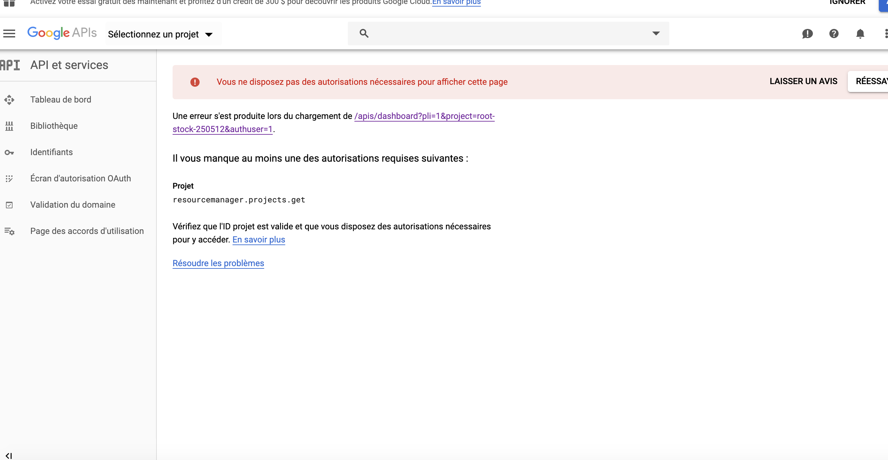
* Nous aurons besoins de créer un projet en cliquant sur le bouton `sélectionner un projet` ensuite sur le bouton `NEW PROJECT`.
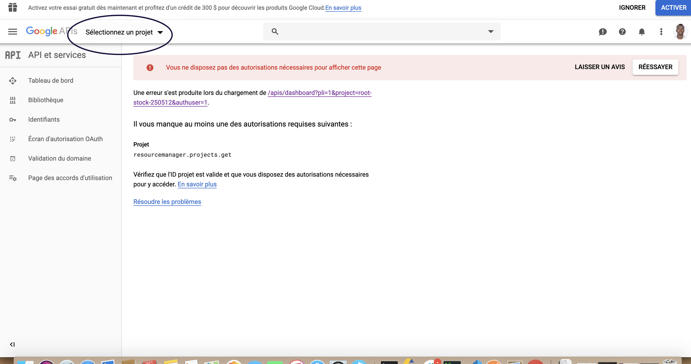
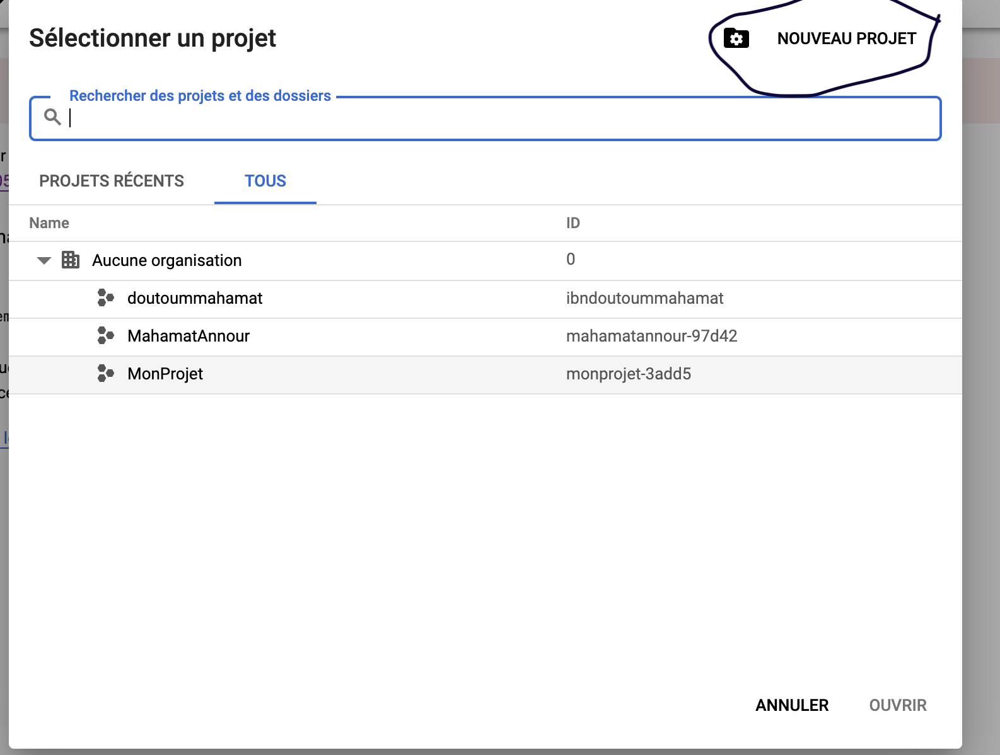
* Une nouvelle fenêtre s'ouvre ou on doit saisir
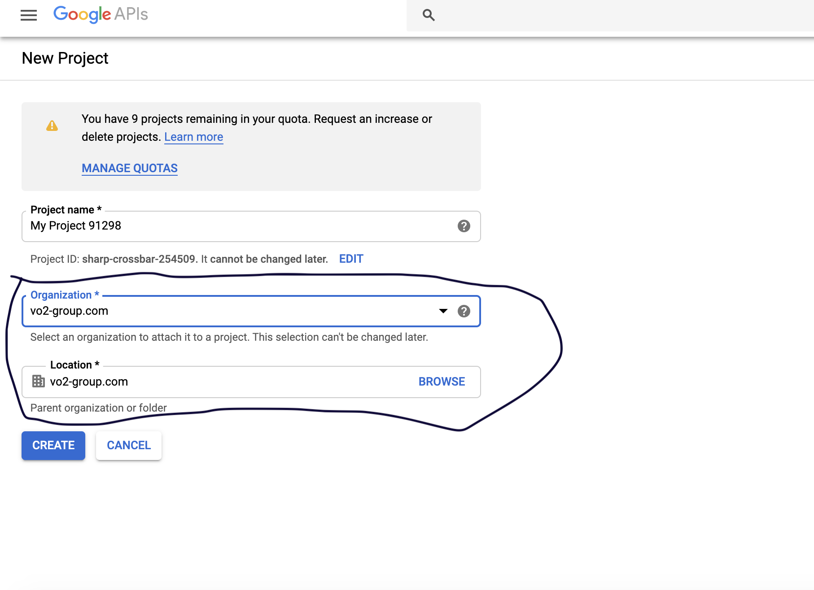
    * le `nom` du projet
    * sélectionner l'organisation 
    * cliquer sur le bouton `CREATE`
* Une fois le projet créé nous aurons l'affichage suivant ou apparait le bouton `Enable Apis and Services`.
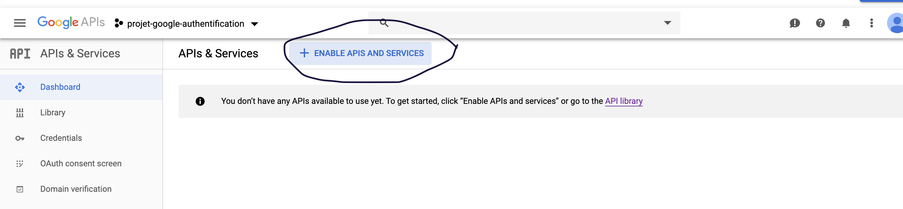
* cliquer sur ce bouton et chercher `Google+`.
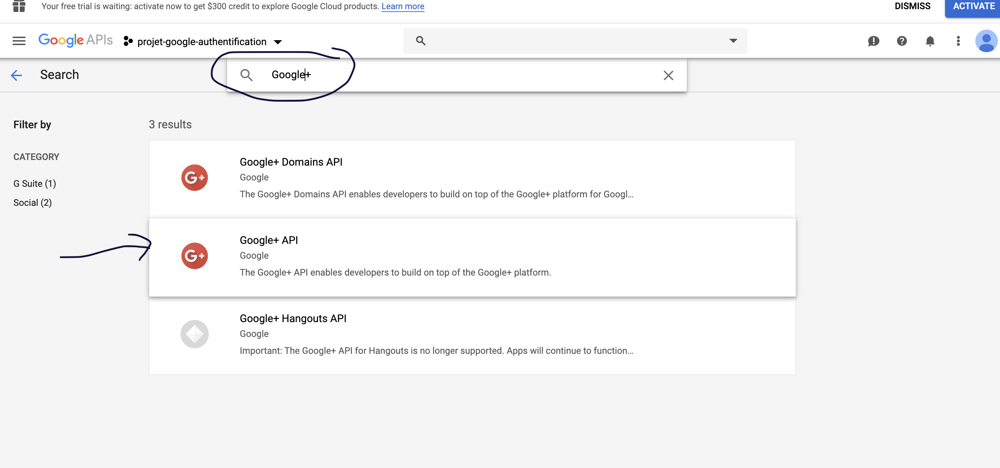
* Sélectionner sur `Google+ API`dans le résultat et cliquer sur `Enable`.
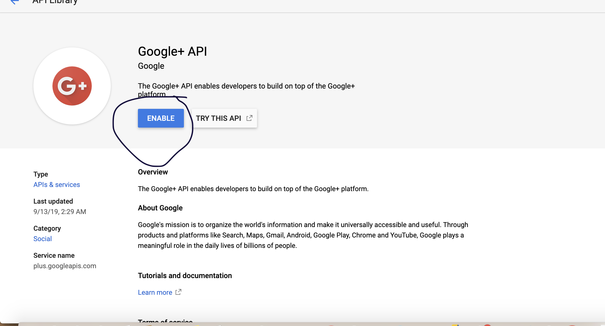
* cliquer sur `Create credentials`, apparait une fenetre ou il faut saisir les infos suivantes:
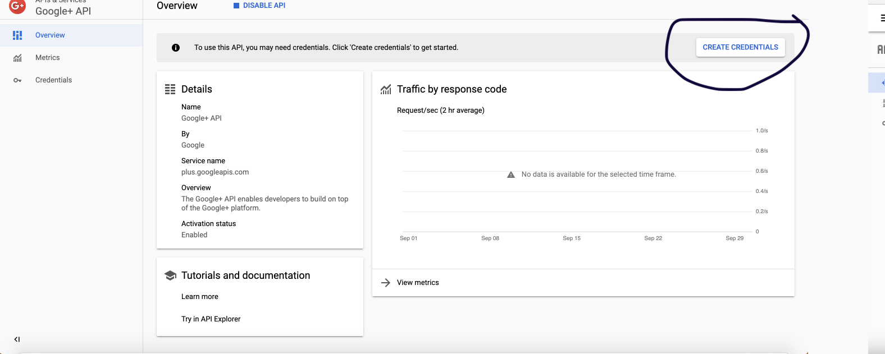
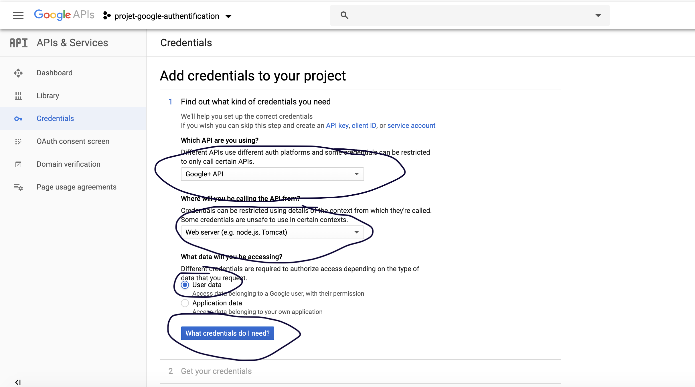
    * sélectionner  l'api: sélectionner `Google+ API`
    * l'endroit depuis lequel appelé l'api: sélectionner `Web server`
    * type de données à accéder:  prendre `userdata`
    * cliquer sur le bouton `What credentials do I need?`.
* apparait une autre fenêtre, dans laquelle il faut saisir des informations qui sont:
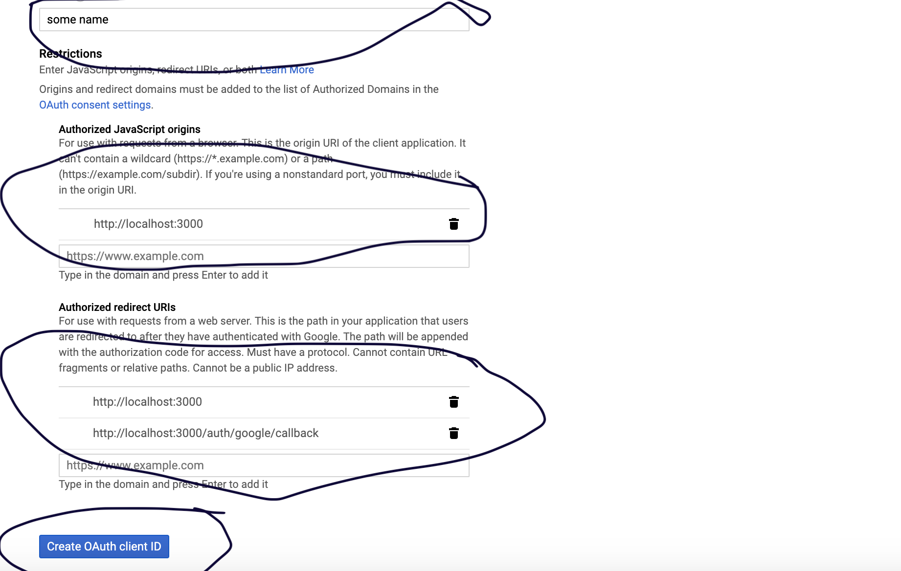
    * le nom
    * liens vers un javascript autorisé:   http://localhost:3000
    * lien de redirection autorisé:   http://localhost:3000/auth/google/callback
    * cliquer sur `create OAuth client ID`.
* cliquer sur le button `I'll do it later`
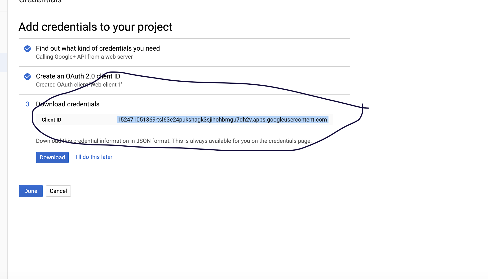

* Nous avons ici la liste de credentials. Pour plus de détails, cliquer sur l'élement en question.
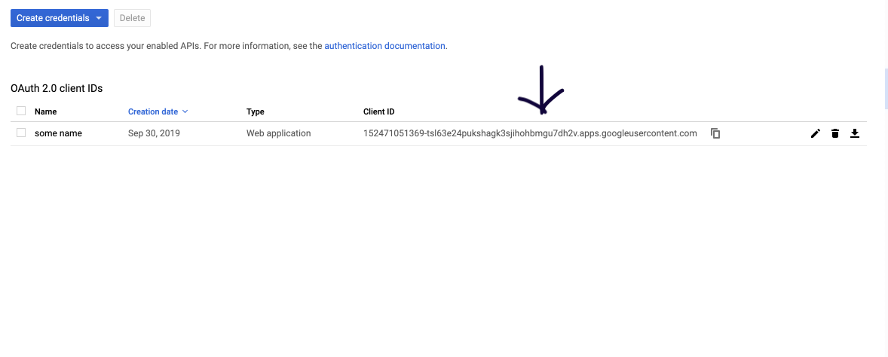
* voici les elements indispensables à notre api d'authentification.
    * Le client ID
    * Le client secret
    * Les liens de redirection autorisés. 
    * 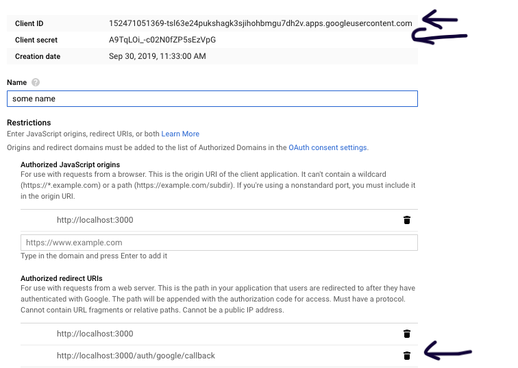


Exemple de mise en place de l'authentification avec passport-google-oauth.

````
#Fichier : passport-local-setup.js
const  GoogleStrategy  =  require('passport-google-oauth').OAuth2Strategy;
module.exports  = (passport, refresh) => {
	passport.serializeUser((user, done) => {
		done(null, user);
	});
	passport.deserializeUser((user, done) => {
		done(null, user);
	});
	const  strategy  =  new  GoogleStrategy({
		clientID:  '1019368872506-6i3015f6aid7n8t62e8jovm871rrm6o2.apps.googleusercontent.com',
		clientSecret:  "I8UEKe0SpRm7Gl55awYEPz5e",
		callbackURL:  "/auth/google/callback"
	},(token, refreshToken, email, done) => {
		return  done(null, {
			email:  email,
			refreshToken:  refreshToken,
			token:  token
		});
	});
	passport.use(strategy);
	refresh.use(strategy);
};
````

````
#fichier: user.service.js
...
const  passport  =  require('passport');
const  db  =  require('../../../models');
const  config  =  require(__dirname  +  '/../../../config/config.json')[env];
const  jwt  =  require('jsonwebtoken');

const  authService  = {
	login: (req, res, next) => {
		passport.authenticate('local', { session:  false }, (err, user, info) => {

			const  PATH  =  '/user/login';
			const  idCorrelation  =  basicFunction.idCorrelation(req);
			try {
				req.login(user, { session:  false }, (err) => {
					if (err) {
						res.send(err);
					}
					db.users.findOne({
						where: { login:  user.email },
						attributes: ['id', 'login', 'hashed_password', 'user_status', 'id_contact']
					}).then(existedUser  => {
						if (!existedUser) {
							logger.error(`${PATH} - ${idCorrelation} - Incorrect Login for user ${user.email}`);
							return  res.status(400).send(errorResponse(constants.CODE_MESSAGE_INCORRECT_LOGIN));
							}
						const  validPass  =  bcrypt.compareSync(user.password, existedUser.hashed_password);
						if (!validPass) {

							logger.error(`${PATH} - ${idCorrelation} - Incorrect Password for user ${existedUser.login}`);
							return  res.status(400).send(errorResponse(constants.CODE_MESSAGE_INCORRECT_PASSWORD));
						}
						if (existedUser.user_status.toLowerCase() ===  'deactivated') {
							logger.error(`${PATH} - ${idCorrelation} - Deactivated Account for ${user.email}`);
							return  res.status(401).send(errorResponse(constants.CODE_MESSAGE_USER_DEACTIVATED));
						}
						const  token  =  jwt.sign({
								email:  existedUser.login
							}, config.passport_key, { expiresIn:  '10m' });
						// on ajoute aussi un refresh token
						const  refreshToken  =  jwt.sign({
							email:  existedUser.login
						}, config.refresh_token_secret, { expiresIn:  '10m' });
						// on stocke le token refreshToken pour le reutiliser.
						tokenList[refreshToken] =  response
						logger.info(PATH  +  ' - User connected '  +  existedUser.login);
						return  res.json({ err, email:  existedUser.login, info, token, refreshToken });
					});
				});
			} catch (err) {
				res.status(400).send(err)
			}
		})(req, res);
	},
	logout:  async (req, res, next) => {
		const  PATH  =  '/user/logout';
		const  idCorrelation  =  basicFunction.idCorrelation(req);
		req.logout();
		return  res.status(200).json({ message:  "DELETED_SUCCESSFULLY" });
	},
	token:  async (req, res) => {
		const  currentUser  =  await  queryUser.findOnlyUserByEmail(req.user.email);	
		// check that refresh token and auth token are valid before processing

		if ((postData.refreshToken) && (postData.refreshToken  in  tokenList)) {
			const  user  = { email:  existedUser.login };
						const  token  =  jwt.sign(user, config.secret, { expiresIn:  config.tokenLife });
			const  token  =  jwt.sign({
			email:  existedUser.login
			}, config.passport_key, { expiresIn:  '10m' });
			const  refreshToken  =  jwt.sign({email:  existedUser.login}, 
			config.refresh_token_secret, { expiresIn:  '10m' });
			const  response  = { token };
			// update the token in the list
			tokenList[postData.refreshToken].token  =  token;
			res.status(200).json(response);
		} else {
			res.status(404).send('Unknown Refresh token');
		}
	}
};
module.exports.authService  =  authService;
````


````
const  express  =  require('express');
const  router  =  express.Router();
const  passport  =  require('passport');
const  userService  =  require('./service/user.service');

router.post('/login', (req, res, next) => {
	userService.authService.login(req, res, next);
});

router.post('/logout', passport.authenticate('jwt', { session:  false }), (req, res, next) => {
	userService.authService.logout(req, res, next);
});

router.post('/token', passport.authenticate('jwt', { session:  false }), (req, res, next) => {
	userService.authService.token(req, res, next);
});
module.exports  =  router;
````

````
#fichier: auth-google.js
const  passport  =  require('passport');
var  express  =  require('express');
var  router  =  express.Router();
router.get('/google', passport.authenticate('google', {
	scope: ['email'] # le type de retour
}));
router.get('/google/callback', passport.authenticate('google'), (req, res) => {
	res.json({
		email:  req.user.email,
		refreshToken:  req.user.refreshToken,
		token:  req.user.token
	})
});
router.get('/logout', (req, res) => {
	req.logout();
	res.send('/');
});
module.exports  =  router;
````

````
#fichier app.js
...
const  passport  =  require('passport');
const  googleAuthSetup  =  require('./utils/passport-google-setup');
const  googleAuth  =  require('./routes/auth-google');
googleAuthSetup(passport, refresh);
app.use(passport.initialize());
app.use('/auth', googleAuth);
````
